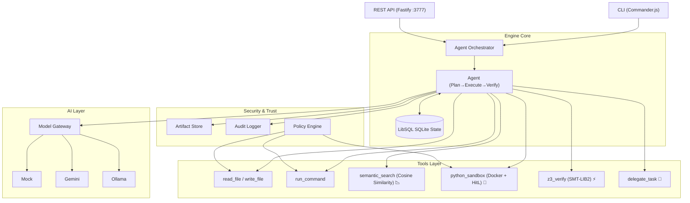

# OpenGravity Core Engine 🌌
Note :- the V2 of this will come next with the some more updates stay tune with me we build the open source agentic IDE that beaks everything 
> **A headless, infrastructure-first autonomous AI orchestration engine.**

OpenGravity is a production-grade backend engine designed to execute complex, multi-step software engineering tasks autonomously. It sits between user interfaces (like a CLI or VS Code extension) and Large Language Models, providing a robust sandbox, verifiable execution, and massive token reduction.

## ✨ Key Features (V2 Architecture)

### 1. 📉 True Vector RAG (Semantic Token Reduction)
Standard agents dump entire codebases into the LLM context, causing massive token burn and severe hallucinations. OpenGravity uses **True Vector RAG** (`semantic_search`). When the LLM needs to understand how a component works, the tool chunks the local codebase, generates embeddings using **Gemini (`text-embedding-004`)**, performs mathematical **Cosine Similarity**, and returns *only the exact top 3 lines needed*. 
*Result: 50,000 token queries reduced to 500 tokens.*

### 2. 🐍 Containerized Python Sandbox (Pass-by-Reference Memory)
Passing large datasets through an LLM chat window will crash the engine. OpenGravity enforces a **Pass-by-Reference** paradigm. 
Agents write and execute Python scripts within a secure `python_sandbox` powered by **Docker**. One agent can pull data and save it to `/workspace/data.csv`. The next agent can write a script to read that exact file. The LLM acts purely as a workflow manager.
*Includes **True Human-in-the-Loop (HitL)**: The Node.js execution loop literally pauses until you hit the `POST /agents/:id/approve` API endpoint.*

### 3. ⚡ Real Z3 SMT Formal Verification
LLMs guess code. OpenGravity **proves** it. Using the official **Microsoft `z3-solver` WASM library**, the engine formally checks constraints:
- Array bounds safety (preventing out-of-bounds errors)
- Null and undefined safety
- Integer overflows
If a constraint fails, Z3 generates a mathematical counterexample and forces the agent to fix the bug before proceeding.

### 4. 🧠 Multi-Agent Protocol & Persistent State
- **Delegate Task Tool:** Agents can spawn specialized sub-agents to solve complex problems in parallel.
- **LibSQL / SQLite Persistence:** Agents do not just live in memory. Every plan, step, and chat message is saved to a local SQLite database (`data/opengravity.db`), meaning agents survive server crashes and can be fully resumed.

### 5. Universal Model Gateway
Zero vendor lock-in. OpenGravity supports plug-and-play LLM routing:
- **Google Gemini:** `gemini-2.5-flash` (Default)
- **OpenAI, Anthropic, Ollama, Mock**

## 🏗️ Architecture



## 🚀 Quick Start

### Installation

```bash
# Clone the repository
git clone https://github.com/mkrishna793/open-antigravity.git
cd open-antigravity

# Install dependencies
npm install

# Setup environment variables
cp .env.example .env
```

### Usage (CLI)

The engine ships with a powerful CLI. You can use the `mock` provider instantly without any API keys.

```bash
# Check engine status and available tools
npm run cli info
npm run cli tools

# Run an autonomous agent
npm run cli run "Create a new Express API with authentication"

# Start interactive chat
npm run cli chat
```

### Using Real Models (Gemini, OpenAI, etc.)

1. Open the `.env` file.
2. Add your API key (e.g., `GEMINI_API_KEY="your_key"`).
3. Set the default model: `DEFAULT_MODEL=gemini:gemini-2.5-flash`.
4. Run your tasks!

### API Server

OpenGravity can be controlled programmatically by any frontend (like a VS Code extension) via its REST API.

```bash
# Start the Fastify server on port 3777
npm run cli serve
```

## 🛡️ Security & Sandboxing

The **Policy Engine** operates on a default-deny principle for destructive operations:
- Blocks dangerous shell commands (`rm -rf`, `DROP TABLE`).
- Prevents writing outside of the designated workspace directory.
- Blocks elevated privilege requests (`sudo`).
- Human-in-the-Loop interception for sandbox Python execution.

## 📜 License
MIT License
